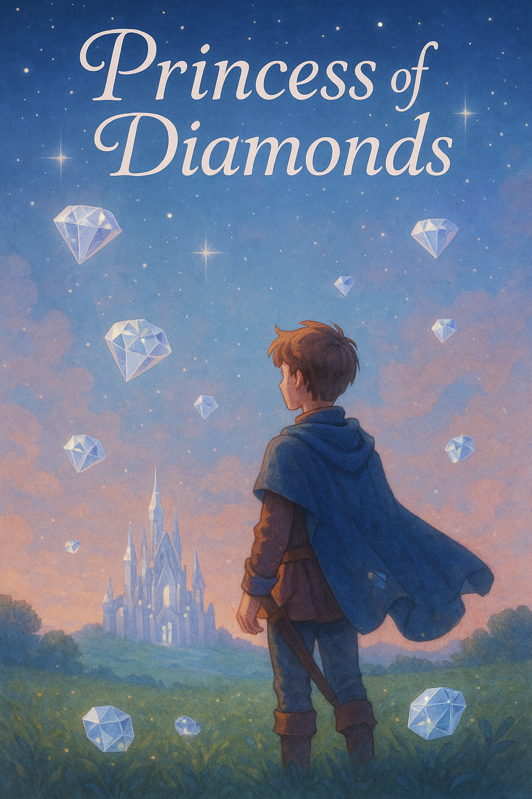

# 👑 Princess of Diamonds

*A playful Twine game adaptation based on Michel Ocelot's short film "The Princess of Diamonds" (2000)*

## 🎮 Play the Game

👉 [Click here to start your adventure](https://kokozzzz.github.io/princess-of-diamonds/)

---

## 📖 Story Overview

You are a brave prince embarking on a magical quest to awaken a cursed princess.  
To do so, you must gather **111 diamonds** scattered across a mysterious cave, a crystal garden, and a bustling town.

But beware—your choices matter.

Some paths are rewarding, others... not so much.  
You might even discover a **hidden emotional tale** if you're curious enough.

---

## 🕹️ Features

- 🎭 Branching story with multiple paths
- 💎 Diamond-collecting system with counters
- 🧭 Map-based navigation
- 🐸 Hidden easter egg route (can you find it?)
- 🎨 Original visual polish and customized layout

---

## 🧠 Inspiration

This game is a creative adaptation of *"La Princesse des Diamants"*, one of six silhouette fairy tales in Michel Ocelot’s animated anthology *Princes and Princesses* (2000).

It’s a tribute to the charm, playfulness, and emotion of the original.

---

## ✨ Tech Stack

- Twine 2 (Harlowe story format)
- Hosted on GitHub Pages

---

## 🗣️ Feedback?

Feel free to [open an issue](https://github.com/kokozzzz/princess-of-diamonds/issues)  
or just tell me what you think after playing!

